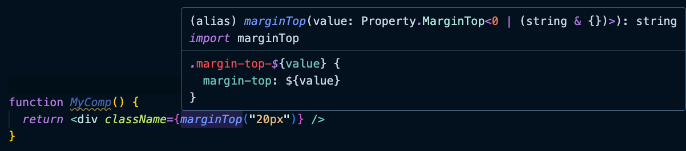
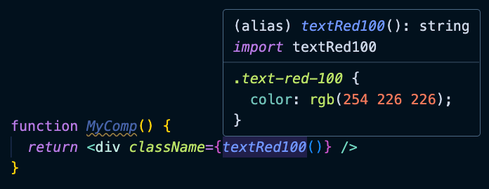

[EN](../Atomic.md) | ZH

# 介绍
原子 CSS 和工具优先的框架作为一种简单而强大的组件样式化方法正在迅速流行。

原子 CSS 涉及为短小的“原子”类定义样式，它们针对单个样式声明，例如 `.text-red-500()` 表示红色文本或 `.truncate()` 表示截断文本。你可以通过叠加这些类来组合元素，从而实现极其模块化和可重用的样式。

相较于传统的 CSS，原子 CSS 提供了许多优点：

* 可扩展性：通过原子样式的组合轻松构建复杂的设计。
* 简单：类名直接映射到 CSS 声明，具有直观的 API。
* 灵活性：只包含项目需要的准确样式。

许多开发者现在采用实现这个概念的原子优先框架，例如 tailwindcss。

因此，Easy CSS 提供了一种非常方便的方式来使用原子和工具class，它使用 JavaScript 语法实现更好的自动完成，并使用 JSDoc 实现更好的提示。此外，通过使用插件，非常容易自定义工具class。

# 原子class
库 @iandx/easy-css-atomic 包含所有 CSS 样式表，它们对应的值可以通过函数调用获得。函数调用的第一个参数是该值。
```jsx
import { marginTop } from "@iandx/easy-css-atomic"

function MyComp() {
  return <div className={marginTop("20px")} />
}
```
你可以在悬停在该样式上时显示该样式的具体 CSS 描述：


# 工具class
`@iandx/easy-css-utility`库包含了所有来自[tailwindcss](https://tailwindcss.com/)的工具class。


```jsx
import { textRed100 } from "@iandx/easy-css-utility"

function MyComp() {
  return <div className={textRed100()} />
}
```
你也可以悬停在它上面以查看它的class定义：


# 多个class
你可以将 easy-css 与类名字符串工具（如 [clsx](https://github.com/lukeed/clsx)）集成。
```jsx
import { marginTop, paddingRight } from "@iandx/easy-css-atomic"
import { textRed100, fontSemibold, text4xl } from "@iandx/easy-css-utility"
import clsx from "clsx"

function MyComp() {
  return (
    <div className={clsx(
      marginTop("20px"),
      paddingRight("20px"),
      fontSemibold(),
      textRed100(),
      text4xl()
    )}>
      hello
    </div>
  )
}
```
会生成样式：
```html
<style data-tag="🎨easy-css" data-key="text-red100">.text-red100{color:rgb(254 226 226);}</style>
<style data-tag="🎨easy-css" data-key="margin-top-20px">.margin-top-20px{margin-top:20px;}</style>
<style data-tag="🎨easy-css" data-key="padding-right-20px">.padding-right-20px{padding-right:20px;}</style>
<style data-tag="🎨easy-css" data-key="font-semibold">.font-semibold{font-weight:600;}</style>
<style data-tag="🎨easy-css" data-key="text4xl">.text4xl{font-size:2.25rem;line-height:2.5rem;}</style>
```

# 预解析
你可以通过在配置文件（如 babel 或 vite）中设置以下选项，将这些原子类解析为纯类名字符串：

```js
import atomic from "@iandx/easy-css-atomic"
import utility from "@iandx/easy-css-utility"

export default defineConfig({
  plugins: [easyCss({
    utilities: [{
      easyFuncMap: atomic
    }, {
      easyFuncMap: utility
    }]
  })],
})
```
然后在构建时，上述代码将被解析为：
```js
function MyComp() {
  return (
    <div className={clsx(
      "margin-top-20px", 
      "padding-right-20px", 
      "font-semibold", 
      "text-red100", 
      "text4xl"
    )}>
      hello
    </div>
  )
}
```
这会省去很多的运行时！

## 安全名
使用安全名称以解决可能的预解析命名冲突：

```js
import atomic from "@iandx/easy-css-atomic"
import utility from "@iandx/easy-css-utility"

export default defineConfig({
  plugins: [easyCss({
    utilities: [{
      easyFuncMap: atomic,
      safeName: "A"
    }, {
      easyFuncMap: utility,
      safeName: "U"
    }]
  })],
})
```
然后在构建时，这
```js
const myClassNames = clsx(
    A.marginTop("20px"),
    paddingRight("20px"),
    U.fontSemibold(),
    textRed100(),
    text4xl()
)
```
会被解析成：
```js
const myClassNames = clsx(
    "margin-top-20px",
    paddingRight("20px"),  // won't be pre-parsed
    "font-semibold",
    textRed100(),  // won't be pre-parsed
    text4xl()  // won't be pre-parsed
)
```
# 使用预解析的自定义工具class
你可以轻松构建自己的类工具程序包，并利用 easy-css 的构建时预解析能力。

1. 创建自定义class包
```js
// ~> ./myUtility
import { css } from "@iandx/easy-css"

export const largeRed = () => css`
    color: red;
    font-size: large
`

export const flexWrapper = direction => css`
  display: flex;
  flex-direction: ${direction};
  align-items: center;
  justify-content: center;
`
```
2. 预解析
在配置中
```js
import * as myUtility from "./myUtility"

export default defineConfig({
  plugins: [easyCss({
    utilities: [{
      easyFuncMap: myUtility
    }]
  })],
})
```
3. 快乐coding
```js
import { flexWrapper, largeRed } from "./myUtility"

const myClassNames = clsx(
    flexWrapper("row"),
    largeRed()
)
```
被预解析成
```js
import { flexWrapper, largeRed } from "./myUtility"

const myClassNames = clsx(
    "flex-wrapper-row",
    "large-red"
)
```
